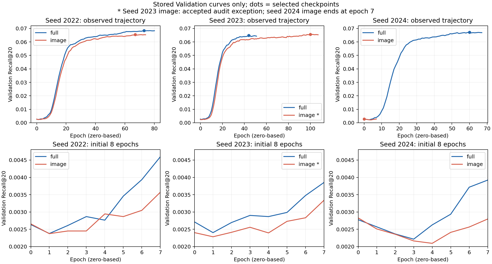

# Baby：三种子 image-only 与完整方法汇总（2026-09-15）

本记录承接 2026-09-14 第一创新点复核，更新其中“完成 seed-2024 后汇总”的阶段。仅读取六次既有运行的 manifest 和收敛记录，并核对现行早停源码；没有训练、加载数据集、模型推理或新增 Validation/Test 排名。Test 表中的数值均为原运行已保存的一次性结果。

## 结果与统计口径

所有指标均为 @20；均值 ± 样本标准差（ddof=1），n=3。epoch 从 0 开始；训练轮数包含最后连续 7 次未提升。完整方法记为 full。

| seed | 配方 | 最佳 Val Recall | Test Recall | Test NDCG | Test Precision | 最佳 epoch / 训练轮数 |
|---|---|---:|---:|---:|---:|---|
| 2022 | full | 0.068425963 | 0.066592341 | 0.030812098 | 0.003661610 | 73 / 81 |
| 2022 | image | 0.065421763 | 0.066704623 | 0.030220134 | 0.003674466 | 67 / 75 |
| 2023 | full | 0.064794230 | 0.065310663 | 0.030520406 | 0.003612754 | 44 / 52 |
| 2023 | image* | 0.065665552 | 0.067630883 | 0.031418323 | 0.003751607 | 100 / 108 |
| 2024 | full | 0.067199794 | 0.066828819 | 0.031615081 | 0.003695037 | 60 / 68 |
| 2024 | image | 0.002828491 | 0.002176224 | 0.001013175 | 0.000123425 | 0 / 8 |

* seed-2023 image-only 为 accepted_by_user_audited_exception。原 manifest 的 paper_ready_eligible=false 必须保留，不能写成自动资格检查通过。原阻断为 teacher_checkpoint 路径分隔符表示差异；实际教师身份经先前审计一致，用户已接受例外。seed-2024 image-only 是 completed、eligible=true 的低指标结果，不是运行失败，不剔除、不替换。

| 配方 | Val Recall | Test Recall | Test NDCG | Test Precision |
|---|---:|---:|---:|---:|
| full | 0.066806663 ± 0.001847508 | 0.066243941 ± 0.000816845 | 0.030982528 ± 0.000566889 | 0.003656467 ± 0.000041382 |
| image | 0.044638602 ± 0.036208824 | 0.045503910 ± 0.037525735 | 0.020883877 ± 0.017218958 | 0.002516500 ± 0.002072822 |

| seed | full − image Test Recall | full − image Test NDCG |
|---|---:|---:|
| 2022 | -0.000112283 | +0.000591964 |
| 2023 | -0.002320219 | -0.000897918 |
| 2024 | +0.064652595 | +0.030601906 |

配对 Test Recall 差值均值为 +0.020740031，样本标准差 0.038045417。2024 的差值占三次差值之和 103.91%；超过 100% 是因为另外两个种子的差值为负。这是结果集中程度的描述，不是因果贡献率。

完整方法在这三个种子、现行停止策略下的平均结果更高、离散度更小；不能据 n=3 宣称统计显著或普遍稳定。2022 的 Recall/Precision 为 image-only 略高，NDCG 为 full 较高；2023 三项 Test 指标均为 image-only 较高；2024 三项均为 full 大幅较高。不能把平均优势写成逐种子一致提升。

## 早停证据

依据 codes/main_mmlight.py:1245 的严格大于规则重放：只有 Recall 超过历史最佳才清零计数，持平也计为未提升；连续 7 次停止。六次曲线重放得到的选中 epoch、最佳指标及停止位置均与保存记录一致。epoch 0 已完成一轮训练，并非未经训练的初始权重。

| seed | full 首次超过 epoch 0 | image 首次超过 epoch 0 |
|---|---:|---:|
| 2022 | 3 | 4 |
| 2023 | 3 | 2 |
| 2024 | 5 | 未观察到（截止 7） |

seed-2024 image-only：Val Recall 从 epoch 0 的 0.002828491 降至 epoch 4 的 0.002094430，随后连续回升至 epoch 7 的 0.002797267，但仍比最佳低 0.000031224（约 1.10%）。因此按原规则正确停止并选择 epoch 0。full 同种子在 epoch 5 达到 0.002935630，已越过自己的初始最佳，得以继续，最终选中 epoch 60。其他 image-only 种子在 epoch 2/4 已越过初值，随后训练到 108/75 轮。

已有损失记录（详见 TRAINING_LOG 的 seed-2024 outcome）中 image-only 总损失 81.419431→80.631762，BPR 80.398411→80.288869，image 蒸馏项 3.403401→1.142979，均为有限数；下降不等于排序质量改善，也不证明更久必然恢复。

已证明：2024 的低最终结果来自现行配方与停止规则共同产生的短轨迹/早期选中检查点；没有发现早停计数实现错误。未证明：第 8 轮是否超过初值、更长训练能否恢复到约 0.06、最终差距有多少由早停解释。图中不延长未观测曲线，不把其他种子的后段嫁接给 2024。其他五条曲线也在停止后被截断，不能据其局部平台断言全局收敛。现有表评估的是含选模/停止策略的配方效果，不是等训练预算下的潜在性能。

## 公式与混杂：论文可采用的限定表述

沿用原复核中正样本 item 方向损失定义，令 L_I、L_T 为归一化学生与冻结教师目标的均方差，则：

$$L_{full}=L_{BPR}+0.3\frac{L_I+0.3L_T}{1.3}=L_{BPR}+0.2307692308L_I+0.0692307692L_T.$$

$$L_{image}=L_{BPR}+0.3L_I.$$

去掉文本项时，image 的实际系数提高了 30%。因此当前对照同时改变监督组成和 image 权重；image 教师目标又经过共享多模态 prompt，不能称为彻底排除文本信息。相同 seed 也不等于已经证明跨版本运行逐 batch 随机流完全配对。完整结构、归一化 MSE/余弦等价及训练—推理公式见 [原复核](INNOVATION1_REVIEW_AND_EXPERIMENT_PLAN_2026-09-14.md)，本次未改模型。

> 在 Baby 数据集的三个预定随机种子及统一 patience=7 选模策略下，完整监督配方取得更高的平均测试指标。该优势主要集中于 image-only 在 seed-2024 的早期停止情形，而另外两个种子的 Recall@20 未显示完整配方优势。因此，现有证据支持两种训练配方在既定协议下表现不同，尚不能将差异单独归因于文本监督，也不能断言延长训练能够消除差距。

第一创新点的证据现在补齐了此项三种子消融，但“文本分量贡献”和“早停敏感性”仍未解耦，不能据此提高核心公式的创新性评级。第二创新点仍未确定。

## 唯一优先下一步（方案，未执行）

建议先准备 seed-2024 的固定预算、仅 Validation 配对诊断：full 与 image-only 各自从相同规定初始化流程重新训练，冻结原损失/学习率/数据/教师，预先规定共同 120 epochs（0–119），该窗口内不以 patience 提前终止，保存逐轮 Val 和最佳 Val，run_final_test=false。120 是覆盖已有最晚最佳 epoch 100 并留出观察窗口的诊断预算，不是调优后最优预算，也不保证收敛。分别声明、由用户逐次手动启动两臂，不自动连续运行；先交付 image-only 一臂的独立命令。必须先增加并核验隔离的诊断协议/配置；不能直接在现有正式 profile 上随意覆盖参数。

这一步回答 image-only 是否会在初始低谷后恢复，并用 full 的共同预算参照区分早停互动；不覆盖原正式结果、不新增 Test、不基于 Test 选择耐心或挑选重跑。只跑 image-only 可探索恢复，但不足以完成同预算配对结论。后续再考虑固定 image 实际系数的去文本对照（full 的 0.2307692308 保持不变），以分离权重混杂；此项不是当前启动授权。效率公平对照和跨数据集验证仍留在原总体计划内。

可复制下一步请求：请准备 seed-2024、image-only 的独立 120-epoch Validation-only 诊断配置和手动命令，作为预先固定预算的配对诊断第一臂；保持损失、学习率及资产不变，禁用窗口内早停和最终 Test，隔离新产物，不替换原结果，不启动训练。

## 来源身份与复核边界

分析起点 HEAD bafb459cbdb50daea838ccdc8299ba79951a9d04，分支 codex/experiment/baby-teacher-baseline。下表列出本次实际读取并计算的 SHA256。每个 run 对应 exp/runs/baby/run_manifest__<run>.json 与 exp/converge/baby/auto__<run>.pkl。既有逐运行检查点/数据/源代码和 Test chronology 的详细审计保留在 TRAINING_LOG；本次不重新加载检查点、不重复全量资产哈希。六个 manifest 均 completed，均记录零本次教师 Test、一次学生 Test。

- 2022 full: 2026-08-02 12_05_26.329228_baby_light_init_pid27620
  - manifest SHA256: 15bbc9b33594e6b428f2d91dd8a443790d20e9b849bec199dc44e082b946b356
  - convergence SHA256: bf0c521c9118256b133ec9cfe813af9632ef705b1da32e9801bd2df143e587e0
- 2023 full: 2026-08-02 13_11_41.705929_baby_light_init_pid4516
  - manifest SHA256: de0baf59683546168535d9a365a901838842b2b7153f16d82cdcbd02fc87e5e3
  - convergence SHA256: 10fd9cf553bb1796ec7738ea79cb6b53e33b1765ac25a96a8ec46a0914dcb712
- 2024 full: 2026-08-02 16_36_39.774993_baby_light_init_pid5916
  - manifest SHA256: cd108133710cd682f4a7d82dbc945ae5fb4eec4588e68cc762394cc8902735fd
  - convergence SHA256: a4520cc9d98078515ea253df09a7d15b6524a68b5635c27fbd30a7b83f17cf28
- 2022 image: 2026-09-14 15_39_12.331441_baby_light_init_pid30688
  - manifest SHA256: 13702b7ea4191bdad027c3e7733a9804fda77a9c0230e028b7dfbb93eba103d2
  - convergence SHA256: 70b75129880c9a727bd03a44cc8a5e3bdbf70b764f5c7886b4e02febd12a4b5f
- 2023 image: 2026-09-14 17_09_49.294989_baby_light_init_pid2004
  - manifest SHA256: 3dda1be595ad4dd2fddf19931bada243e8a1281c20d71278c7815423a3b37bff
  - convergence SHA256: 05a6bc33851aa5d5056b13329c0b9dfbca09e988278f0d085b4f4cf5ac2c08bc
- 2024 image: 2026-09-14 21_32_16.560580_baby_light_init_pid8316
  - manifest SHA256: c48c2ad5d3f324782486be926b819cc2400121f0f1908aa7a604622af1bd7478
  - convergence SHA256: e46afb45aa894393800fa9e905dd1d620045bfa9d67beed87264063d1502085e
