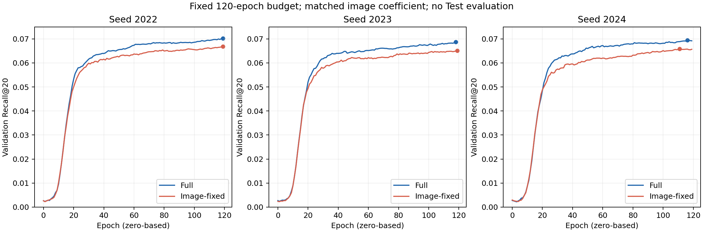

# 第一创新点论文材料与证据总册（2026-09-15 更新）

本册是当前阅读入口，覆盖截至提交 f364cc9 的已审计结果。它更新研究结论与实验计划，不改写历史快照、训练源码或原始产物；不是训练命令或正式评估授权。第二创新点仍然尚未确定。

## 1. 当前结论与阅读方式

**已有两层证据：**原固定配置下，Full 相比纯 ID BPR 的三种子正式 Test 结果均为正增益；控制图像实际系数并统一 120 轮后，显式文本损失在三个种子上均带来正向 Validation 对照差值。后者是新补强的组件证据，不能充当新的 Test 结果。

**尚未闭环：**跨数据集泛化、正确语义与一般正则作用的区分、直接已有方法比较、公平部署成本。损失公式的新颖性不会随指标改善自动增强。当前可写成有实验支持的结构简化与监督配方章节，但不宜声称新损失、SOTA、最优结构或独有在线加速。

| 材料 | 当前状态 | 论文使用方式 |
|---|---|---|
| 方法结构、归一化损失与训练—推理流程 | 源码事实可核对 | 方法章节底稿 |
| BPR / Full 正式结果 | 3 对种子，共用单个冻结教师 | 主比较，限定固定配置 |
| 原 Image-0.3 正式结果 | 3 个种子，含 2023 审计例外和 2024 低结果 | 带混杂解释的配方消融 |
| 固定预算 Full / Image-fixed | 3 对种子，仅 Validation | 控制图像系数后的诊断表 |
| seed-2024 原 Image-0.3 固定预算 | 1 次，仅 Validation | 早停恢复与三臂诊断 |
| 教师参考 | 一个教师种子；不是三个独立教师实验 | 性能上界参考，不计入学生 seed 数 |
| 第二创新点 | 尚未确定 | 不计入完成贡献 |

本册共明确列出 16 次学生运行：9 次正式结果，7 次 Validation 诊断。修复前的不合规重复运行不增加独立样本量。旧 Amazon 探索存在数据身份/重复模态/选模问题，不充当第二数据集证据。历史 text-only、投影、用户侧或效率讨论也不能冒充 audited Baby 的已完成正式证据。

规范：均值和样本标准差以未舍入值计算，SD 分母 n−1；NDCG 取 Recall 选中检查点，而非另选 NDCG 最佳。区分设计目的、代数恒等、实验观察与未证机制。本文没有计算新的推荐排序。


## 2. 公式与源码对应

### 2.1 符号及实现边界

| 符号 | 含义 |
| --- | --- |
| \(n_U,n_I\) | 用户数 19,445；物品数 7,050 |
| \(d\) | 学生和教师语义维度，64 |
| \(R\) | 仅由训练交互构造的二部图矩阵 |
| \(X_v,X_t\) | 物品图像、文本输入特征，维度分别为 4096、384 |
| \(G_{UI},G_{IU}\) | 源码中的用户到物品、物品到用户聚合算子 |
| \(P_U,P_I\) | 教师用户、物品 soft prompt |
| \(T_U^m,T_I^m\) | 教师模态分支输出；\(m\in\{v,t\}\) |
| \(E_U,E_I\) | 学生可训练的用户和物品 ID 表 |
| \(\mathcal B\) | 一个含 \(B=1024\) 个三元组的有序采样批次 |

定义按行/按向量的实现归一化：

\[
N_\epsilon(x)=\frac{x}{\max(\|x\|_2,\epsilon)},\qquad \epsilon=10^{-12}.
\tag{1}
\]

下文写 \(N\) 表示该算子。余弦等价式要求参与的向量范数不小于 epsilon；
零向量及极小向量按实际算子处理，不能无条件套用单位向量恒等式。

源码入口是 [main_mmlight.py](../../codes/main_mmlight.py) 的
`Trainer.train_td_distill`；[parser.py](../../codes/utility/parser.py) 依次
应用 dataset/profile 默认值后解析 CLI。当前正式值由
[dataset_profiles.py](../../codes/utility/dataset_profiles.py) 决定；CLI
覆盖 profile，因此不能从 parser 的其他配置块抄取 `student_lr`。

### 2.2 冻结多模态教师：已有机制及目标来源

本节还原现有教师，不作为本项目新增算法贡献。

在 [Models_mmlight.py](../../codes/Models_mmlight.py) 的 `PromptLearner`
中，两种特征分别经固定 seed-2022 的 64 维 PCA，再平均：

\[
H_I=\tfrac12\left[\operatorname{PCA}_{64}(X_v)+
\operatorname{PCA}_{64}(X_t)\right],\qquad H_U=G_{UI}H_I.
\tag{2}
\]

\[
P_I=H_IW_{p,I}^{\top}+\mathbf1 b_{p,I}^{\top},\qquad
P_U=H_UW_{p,U}^{\top}+\mathbf1 b_{p,U}^{\top}.
\tag{3}
\]

当前 `prompt_dropout=0`；教师提取阶段使用 eval 模式。矩阵按行存储实体，
因此这里显式写 PyTorch Linear 权重的转置，以免论文中的矩阵形状不一致。

当前图归一化实现是 `csr_norm(..., mean_flag=True)`：

\[
G_{UI}=(D_U+10^{-8}I)^{-1/2}R,\qquad
G_{IU}=(D_I+10^{-8}I)^{-1/2}R^\top.
\tag{4}
\]

\(D_U,D_I\) 分别是训练图的用户、物品度对角矩阵。尽管参数名带 `mean`，
实际是左侧行度的负二分之一次幂，不是 \(D^{-1}R\)，也不是两侧对称归一化。
两个算子一般不互为转置。

教师模态分支的 eval 前向为：

\[
Z_m=\left[X_m+\eta N(P_IP_I^\top X_m)\right]W_m^\top
+\mathbf1 b_m^\top,\qquad \eta=1.
\tag{5}
\]

\[
T_U^m=G_{UI}Z_m,\qquad T_I^m=G_{IU}T_U^m.
\tag{6}
\]

当前 `layers=1`，所以式（6）描述实际单次模态传播。不能未经检查就把这段
实现推广写成任意层递归 GNN：源码循环没有将 item 输出回写到下一轮输入。

教师另有 ID 协同分支。初始向量为教师 ID 表加
\(\rho N(P_U),\rho N(P_I)\)，其中 \(\rho=0.005\)。当前两个协同传播层
按“先更新用户、再用新用户更新物品”的顺序执行；最后一层对各实体向量
施加维度 softmax，并平均初始层与两层输出，得到 \(\bar C_U,\bar C_I\)。
最终教师推荐表示是：

\[
F_U=\bar C_U+\kappa N(T_U^v)+\kappa N(T_U^t),\qquad
F_I=\bar C_I+\kappa N(T_I^v)+\kappa N(T_I^t),\quad\kappa=0.55.
\tag{7}
\]

教师评分为 \(F_U[u]^\top F_I[i]\)。教师训练的实际目标包含融合表示 BPR、
prompt BPR（系数 100）、两种模态 BPR（各系数 1）、融合表示 batch 正则和
全体模态特征正则，并使用 AdamW。原教师机制如需写入论文，应引用来源并
以 `Trainer.train` 的有效表达式为准；已计算但未加入总目标的变量不能列作
训练损失。

学生阶段从已选教师 checkpoint 加载模型，教师和 prompt **都冻结**，
在 no-grad / eval 下缓存 \(T_I^v,T_I^t,T_U^v,T_U^t\)。缓存作为本轮运行
训练期张量使用，不随学生优化更新。当前直接监督取的是 \(T_I^m\)，不是
式（7）的 \(F_I\)，也不是原始图像/文本特征。

重要后果：\(P_I\) 来自图文共同构造的 hard token，因此仅保留 item-image
损失仍可能利用文本来源的信息。它是“关闭文本蒸馏项”，不是“完全无文本”。

### 2.3 纯 ID 学生与 BPR

[td_distill_model_no_projection.py](../../codes/td_distill_model_no_projection.py)
中的学生只训练两张表，使用 Xavier uniform 随机初始化：

\[
E_U\in\mathbb R^{n_U\times d},\quad E_I\in\mathbb R^{n_I\times d},\quad
s_u=E_U[u],\ s_i=E_I[i],\quad \hat y_{ui}=s_u^\top s_i.
\tag{8}
\]

当前 `td_init_from_teacher=false`，没有教师向量 warm start。

每批采样不同的训练用户，为每个用户抽取一个训练正物品及一个不在该用户
训练交互中的负物品。不同用户可能重复抽到同一物品。不存在“每轮把每条
训练边恰好遍历一次”的保证：一轮是 116 个独立采样批次。

\[
L_{\mathrm{BPR}}=-\frac1B\sum_{b=1}^{B}
\log\sigma\left(s_{u_b}^\top s_{i_b^+}-s_{u_b}^\top s_{i_b^-}\right).
\tag{9}
\]

### 2.4 方向约束及完整目标

实际使用的损失函数从
[td_distill_model.py](../../codes/td_distill_model.py) 导入：
`F.normalize(student)`、`F.normalize(teacher.detach())` 后调用
`F.mse_loss(..., reduction='mean')`。

对模态 \(m\)，物品分量为：

\[
L_{I,m}=\frac1{Bd}\sum_{b=1}^{B}
\left\|N(s_{i_b^+})-N(\operatorname{stopgrad}(T_{i_b^+}^m))\right\|_2^2.
\tag{10}
\]

用户分量若启用，则对 \(s_{u_b},T_{u_b}^m\) 做同样计算。当前用户侧权重
均为零，只有式（10）两项生效。负物品参与 BPR，没有直接语义损失；重复
正物品按出现次数计权，不是对全体物品均匀平均。

代码把负 rate 截为零，再按活跃分量权重和归一化。对本记录的非负配置：

\[
L_{\mathrm{sem}}=\frac{\sum_{c:r_c>0}r_cL_c}{\sum_{c:r_c>0}r_c},\qquad
L=L_{\mathrm{BPR}}+\alpha L_{\mathrm{sem}}.
\tag{11}
\]

若 alpha 为零或全部 rate 为零，退化为 BPR。完整方法为：

\[
(r_{I,v},r_{I,t},r_{U,v},r_{U,t})=(1,0.3,0,0),\qquad\alpha=0.3,
\]

\[
\boxed{L_{\mathrm{full}}=L_{\mathrm{BPR}}+
\frac{0.3}{1.3}L_{I,v}+\frac{0.09}{1.3}L_{I,t}.}
\tag{12}
\]

有效图像、文本系数分别约为 0.2307692308、0.0692307692；不能写成
\(L_{\mathrm{BPR}}+0.3L_{I,v}+0.09L_{I,t}\)。同时成比例放大所有活跃 rate
不会改变式（11）。

优化器为 AdamW，`student_lr=6e-5`、weight decay `0.01`。权重衰减由优化器
执行，不应伪装成代码总 loss 中显式加入、且与 AdamW 数学等价的 L2 项。
日记中每轮 loss 通常是 batch 标量之和，不能直接当作式（9）的一批均值。

“无投影”意味着 `project_items` 的两个输出引用同一个 \(s_i\)；没有两套
学生模态向量，没有可训练双头网络。方向是嵌入方向，不是梯度兼容控制。

### 2.5 与余弦距离的等价关系

若 \(\|s\|,\|t\|\ge\epsilon\)，有：

\[
\frac1d\|N(s)-N(t)\|_2^2=
\frac2d\left(1-\frac{s^\top t}{\|s\|_2\|t\|_2}\right).
\tag{13}
\]

因此式（10）是缩放的平均余弦距离。\(d=64\) 时比例是 \(2/d=1/32\)。
把实现换成 `mean(1-cos)` 而保留同一 alpha，会改变监督尺度，不是等价复现。
本记录仅解释等价性，没有修改实现或任何参数。

单位向量平方距离每样本不超过 4，因此对应每批平均分量不超过 \(4/d\)。
这并不表示语义梯度一定弱：归一化的梯度还与原始学生向量范数有关。
方向损失不直接匹配教师范数，也不保证学生在 BPR/AdamW 下的范数不变。

### 2.6 两个模态等价于怎样的合成目标

对同一非退化正物品，令 \(z=N(s_i)\)、\(a=N(T_i^v)\)、\(b=N(T_i^t)\)，
并定义**未再次归一化**的合成向量：

\[
q_i=\frac{a+0.3b}{1.3}.
\tag{14}
\]

对应的单物品混合损失满足：

\[
\frac{\|z-a\|_2^2+0.3\|z-b\|_2^2}{1.3d}
=\frac2d(1-z^\top q_i)
=\frac1d\|z-q_i\|_2^2+\frac{1-\|q_i\|_2^2}{d}.
\tag{15}
\]

右侧最后一项相对学生是常数。这是源码的代数解释，不是新增融合模块。
不可以把目标直接替换为 \(N(q_i)\) 后声称目标不变。

若 \(a,b\) 均为单位向量，则：

\[
\|q_i\|_2=\frac{\sqrt{1+0.3^2+0.6\cos(a,b)}}{1.3}.
\tag{16}
\]

两个目标的夹角同时影响合成方向与约束强度；图文完全相反时范数为
\(0.7/1.3\)，相同时为 1。故“添加文本”未必只是加入独立有益知识。
这是可能的解释，不能仅凭式（16）宣称实际训练存在负迁移或梯度冲突。

### 2.7 选择、Test 与推理

```text
训练图与图文特征 -> 已训练教师及 prompt（全部冻结）
                 -> 固定语义缓存 -> 与 BPR 联合监督纯 ID 学生
Validation Recall@20 -> 选最佳 epoch -> 恢复最佳 checkpoint
                     -> 一次学生 Test -> 导出用户/物品 ID 表
部署：用户 ID + 物品 ID -> 查表 -> 点积/排序
```

协议是 `val_test_once_v1`，Validation 和 Test 候选都仅排除训练交互
（`train_only`）。`test_flag=part` 不计算 AUC，但仍是全物品 top-K 排序，
不是负采样评估。最大 epoch 1000，patience 7；冻结教师复用时零次教师 Test。

推理无需教师、prompt、模态特征、语义缓存、图传播、投影或优化器状态。
部署向量数为 \((19445+7050)\times64=1,695,680\) 个 float32，净存储
6,782,720 字节，约 6.4685 MiB；序列化文件另有元数据开销。
单个评分为 \(O(d)\)，全物品打分为 \(O(n_Id)\)，不能把全量推荐写成 O(1)。

当前训练入口仍会构造/加载教师，即使 alpha=0；独立推理产物的性质不等于
现有整个启动入口无教师依赖。官方保留三个 evaluation-only 物品，故不能
以该闭集 ID 方法的整体结果声称解决新物品冷启动。


### 2.8 新增对照公式与协议分支

前述公式（1）—（16）沿用源码对应推导。上节的最大 1000 epoch / patience 7 描述原正式协议；新增诊断明确使用 120 epoch / patience 120，不执行最终 Test。

\[
L_{\mathrm{Image\text{-}0.3}}=L_{\mathrm{BPR}}+0.3L_{I,v}.
\tag{17}
\]

\[
L_{\mathrm{Image\text{-}fixed}}=L_{\mathrm{BPR}}+\frac{0.3}{1.3}L_{I,v}.
\tag{18}
\]

Full 与 Image-fixed 的图像实际系数相同，前者增加 \((0.09/1.3)L_{I,t}\)。实现通过 image-only 的 alpha=0.23076923076923075 达成；只改唯一活跃项的 rate 会被分母抵消，不能达到同样目的。Full 与 Image-0.3 则同时改变图像权重和文本项，不是纯去文本控制。

教师目标仍由共享图文 prompt 生成。关闭显式文本损失不等于删除所有文本信息。增加文本项也改变总监督强度，当前对照没有排除“额外正确约束或一般正则”的全部解释。

| 流程节点 | 原正式协议 | 固定预算诊断 |
|---|---|---|
| 初始化 | 随机 ID64，非教师 warm start | 相同 |
| 教师与 prompt | 冻结，缓存目标 | 相同 |
| 训练 | cap 1000、patience 7 | 120 轮（0–119）、patience 120 |
| 选模 | Val Recall@20 首次严格最大 | 相同 |
| 教师 Test | 学生运行内为 0 | 0 |
| 学生 Test | 选模后 1 次 | 0 |
| 完成状态 | completed | validation_completed |
| 资格字段 | 通常 true，2023 例外另列 | false 为主动诊断设置的预期状态 |

诊断不是“失败的正式结果”。原 2023 manifest 的 false 是路径表示差异导致的原硬门问题，性质与本批关闭 Test 的预期 false 不同，不能混为一谈。

## 3. 正式结果：单独保留 Test 表

以下只汇总原协议，不能将新诊断的最佳 Validation 填入这些 Test 单元格。单位均为 @20；epoch 从 0 开始。

| seed | 方法 | 最佳 Val R | Test R | Test N | Test P | 最佳 epoch / 已训练轮数 |
|---|---|---:|---:|---:|---:|---|
| 2022 | BPR | 0.042913039 | 0.044279857 | 0.019996625 | 0.002478786 | 163 / 171 |
| 2022 | Full | 0.068425963 | 0.066592341 | 0.030812098 | 0.003661610 | 73 / 81 |
| 2022 | Image-0.3 | 0.065421763 | 0.066704623 | 0.030220134 | 0.003674466 | 67 / 75 |
| 2023 | BPR | 0.040982747 | 0.036806542 | 0.017025150 | 0.002057084 | 72 / 80 |
| 2023 | Full | 0.064794230 | 0.065310663 | 0.030520406 | 0.003612754 | 44 / 52 |
| 2023 | Image-0.3 † | 0.065665552 | 0.067630883 | 0.031418323 | 0.003751607 | 100 / 108 |
| 2024 | BPR | 0.040866547 | 0.042307914 | 0.019323064 | 0.002409360 | 163 / 171 |
| 2024 | Full | 0.067199794 | 0.066828819 | 0.031615081 | 0.003695037 | 60 / 68 |
| 2024 | Image-0.3 | 0.002828491 | 0.002176224 | 0.001013175 | 0.000123425 | 0 / 8 |
| 方法 | Test R 均值 ± SD | Test N 均值 ± SD |
|---|---:|---:|
| BPR | 0.041131438 ± 0.003873071 | 0.018781613 ± 0.001557977 |
| Full | 0.066243941 ± 0.000816845 | 0.030982528 ± 0.000566889 |
| Image-0.3 | 0.045503910 ± 0.037525735 | 0.020883877 ± 0.017218958 |

Full 对固定 BPR 的三种子 Test Recall 均值相对增益为 61.05%，只说明当前配对配置。未证明优于充分调优 MF、原 PromptMM 学生或其他强方法。冻结教师的历史 Test R@20=0.08665691369856875、N@20=0.04042213264283099（引用原复核与日志，不新增测量）；Full 学生平均 Recall 约为教师的 76.44%，不能称为无损。

原 Image-0.3 的 2022、2023 Test Recall 略高于 Full，2024 大幅低；不能用其平均值宣称逐种子一致的文本提升。2024 正常完成，选中 epoch 0，必须保留这次低 Test，不用新诊断替换或补测后择优。

† **必须随表披露：**2023 Image-0.3 按用户批准的 accepted_by_user_audited_exception 纳入。原 manifest 保持 status=completed、paper_ready_eligible=false；原 blocker 来自教师路径斜杠表示导致的 override。先前审计确认教师对象与 hash 一致，不等于原自动硬门通过；原失败记录与接受记录均保留，没有重跑择优或改写产物。原 manifest SHA256 为 3dda1be595ad4dd2fddf19931bada243e8a1281c20d71278c7815423a3b37bff。手动退出码未被捕获，不补写虚构退出码。

## 4. 固定图像系数、固定预算：仅 Validation 表

以下 6 次运行均为 120 轮，不用 patience 7 停止。Full 与 Image-fixed 的图像系数都为 0.3/1.3。

| seed | 方法 | 最佳 Val R | 对应 Val N | 最佳 epoch | epoch119 Val R |
|---|---|---:|---:|---:|---:|
| 2022 | Full | 0.070224687 | 0.031049971 | 119 | 0.070224687 |
| 2022 | Image-fixed | 0.066874579 | 0.029762471 | 119 | 0.066874579 |
| 2023 | Full | 0.068724730 | 0.031007462 | 118 | 0.068699017 |
| 2023 | Image-fixed | 0.065069120 | 0.029563618 | 119 | 0.065069120 |
| 2024 | Full | 0.069437363 | 0.030732406 | 116 | 0.069180228 |
| 2024 | Image-fixed | 0.065790324 | 0.029346525 | 111 | 0.065660532 |
| seed | Full − Image-fixed Val R | Full − Image-fixed 对应 Val N |
|---|---:|---:|
| 2022 | +0.003350108 | +0.001287500 |
| 2023 | +0.003655610 | +0.001443844 |
| 2024 | +0.003647039 | +0.001385880 |
| 方法 | Val R 均值 ± SD | 对应 Val N 均值 ± SD |
|---|---:|---:|
| Full | 0.069462260 ± 0.000750288 | 0.030929946 ± 0.000172390 |
| Image-fixed | 0.065911341 ± 0.000908793 | 0.029557538 ± 0.000208040 |

配对 Recall 增量均值 0.003550919，样本 SD 0.000173960；均值比值提升 5.3874%。三个 seed 的 R、对应 N 均同向，epoch119 Recall 也全部同向。没有作统计显著性声明；120 个相关轮次不构成 120 个独立样本。

## 5. 早停影响与三臂诊断



上图只连接已有记录，标点为选中检查点。多次最佳落在末尾，不能据固定预算称全局收敛。seed2022 两臂及 seed2023 Image-fixed 均在 epoch119 最佳，seed2023 Full 在118最佳；本次不据此自动延长预算。

seed2024 的原 Image-0.3 前8轮验证指标与120轮重跑完全一致，loss 汇总最大差约5.96e-8，不能声称全部状态位级相同。它在 epoch7 因未超过初始最佳而停止，新运行 epoch8 就突破，最终最佳达0.066461938（epoch114）。Full 的新旧 Recall 前68轮也完全一致；旧规则选中60并于67停止，新诊断选中116。因而两臂都可能在旧停止点后提升。

| seed2024 配方 | 120轮最佳 Val R | 最佳 epoch |
|---|---:|---:|
| Image-0.3 | 0.066461938 | 114 |
| Image-fixed | 0.065790324 | 111 |
| Full | 0.069437363 | 116 |

原 Full−Image-0.3 的所选 Val 差为0.064371304；固定120后为0.002975425。早停放大了原差距，但不能将差值缩小百分比当作因果归因比例。固定图像系数后 Full−Image-fixed 为0.003647039；这次文本损失对照已推广到三个种子。不能把上述任何数值写成 Test 恢复或新 Test 性能。

## 6. 结论—证据—边界

| 论文主张 | 状态与支持 | 仍不能推出 |
|---|---|---|
| 固定教师监督优于本配置 BPR | 原三种子正式 Test 支持 | 胜过充分调优已有方法或 SOTA |
| 文本损失在固定图像系数下有增益 | 三种子、120轮 Validation 同向 | Test 增益、所有数据集有效 |
| 原 seed2024 Image-0.3 被初期早停截断 | 前缀匹配，epoch8恢复，明确支持 | 较大 patience 普遍最优 |
| 120轮消除了样本间训练轮数差 | 已实施 | 各方法均充分收敛 |
| 文本的正确语义是增益来源 | 部分机制仍未分离 | 排除一般正则/额外监督强度解释 |
| 当前 Image-fixed 是无文本模型 | 不成立 | 共享 prompt 仍含文本来源信息 |
| 无投影/仅物品侧设计优于其他结构 | 当前为实现事实，无决定性 Baby 控制 | 非对称最优、用户监督有害 |
| 纯 ID 导出可用 | 源码与逐运行产物审计支持 | 相比缓存教师必然更快、更省在线存储 |
| 核心损失是原创 | 不支持这种写法 | 归一化 MSE/余弦恒等本身不是新损失 |
| 第二创新点完成 | 否，尚未确定 | RGCS 或其他候选默认成立 |

新实验提高的是组件有效性证据，不自动提高公式新颖性。此前“文本增益信号混合”只适用于原 Image-0.3 正式配方对照；现在可新增“固定图像权重与预算时三种子 Validation 同向”这一更窄结论，两者并不矛盾。

## 7. 可直接改写入论文的段落

### 方法段落

> 学生由用户和物品两张可训练 ID 嵌入表构成，以内积估计交互偏好。训练时固定教师及提示模块，缓存教师的图像和文本模态表示。对采样的正物品，分别计算学生表示与教师模态目标之间的归一化均方差，并与 BPR 排序目标联合优化。两个模态约束作用于同一学生物品表示，不引入额外投影头。语义分量按活跃权重和归一化，当前图像和文本的实际系数分别为0.3/1.3与0.09/1.3。推理阶段只使用 ID 表；教师和模态特征不参与学生评分。

### 主比较段落

> 在 Baby 数据集的三个学生随机种子上，完整配方相对于固定配置的纯 ID BPR 基线均提高测试 Recall@20，均值由0.041131提升至0.066244。各学生共用同一冻结教师，结果描述该教师与优化配置下的效果，不代表对所有基线调优设置的优势。

### 控制实验段落

> 为区分停止策略与监督组成的作用，进一步开展固定120轮、仅使用验证集的诊断。保持图像损失实际系数不变后，完整配方与去文本损失对照的 Recall@20 均值分别为0.069462与0.065911，三个种子上的配对差值均为正。该结果支持显式文本损失在规定预算下的作用，但尚不能区分其语义特异性与额外监督效应，也不作为新的测试集结果。

### 早停分析段落

> 原 seed2024 image-only 运行在 epoch7 触发早停。固定预算复核的前8轮验证曲线与原运行一致，epoch8即超过初始最佳，说明初期验证低谷与停止规则发生了相互作用。完整配方在延长观察窗口后也继续提升。因此，原协议结果保留为真实观测，固定预算结果作为解释其训练动态的补充。

不可直接写：首次方向蒸馏、证明图文互补机制、消除梯度冲突、最优非对称结构、无损压缩、SOTA、教师缓存下独有加速。论文中的“显著”若指统计显著，需要适当证据，不能用同向三种子自动替代。

## 8. 剩余实验最小矩阵与优先级

这是研究计划，不是一次性训练授权。允许将不相互依赖的明确运行一起预声明、由用户顺序手动执行；不得按中途结果临时删改种子或挑选重跑。

| 优先级 | 项目 | 最小设计与计算量 | 通过/未通过如何处理 |
|---|---|---|---|
| 必须先做 | 第二数据集候选审计 | 先查身份、物品顺序、划分重叠、模态有限性/非重复、训练图与冷项规则；不先训练 | 不合格先修身份，旧 Amazon 不直接复用 |
| 必须补 | 第二数据集基本有效性 | 1个声明的教师；BPR、Full、Image-fixed各3学生seed，共9次学生运行；另计教师/有界调参成本 | 同向则补泛化证据，弱收益也保留并收缩结论 |
| 必须补或收缩相关主张 | 公平部署成本 | 缓存最终向量的教师、实时生成教师、BPR和Full；独立进程、相同候选/workload；先设计后测 | 若缓存教师占优，不主张独有在线加速 |
| 必须补强主比较 | 最近已有方法与合理基线 | 至少审计原 PromptMM 学生复现与BPR调参预算；最终3seed/数据集；不能把改model_type当原方法 | 不赢强对照时重新定位贡献，不删除原固定基线 |
| 建议补，若声称正确文本语义机制则必要 | 文本目标固定置换 | 保留真实图像目标和全部系数，仅文本目标按预声明物品置换；先1seed诊断，需稳健主张再补3seed | 与Full接近则收缩语义特异性解释；不可挑置换 |
| 条件性 | 图文目标共同置换 | 两模态用同一置换，保留配对，测试整体身份匹配知识 | 与“仅文本置换”回答不同问题，不必默认两套全跑 |
| 条件性 | 有/无投影、加用户监督、Text-only | 仅为最终保留的结构/单模态主张补；保持初始ID、有效系数和预算 | 不声称结构最优即可减少这些扫描 |
| 暂不做 | 大规模alpha/维度搜索、继续延长2024、第二点堆模块 | 当前缺口不是更多同seed调参 | 不用Test挑最佳或追逐高指标 |

第二数据集的120轮不能机械照搬成“充分收敛”协议。先预声明可接受的验证集试验与预算选择规则，兼顾各方法训练动态；正式多种子前统一冻结。上表9次为固定协议后最低核心矩阵，不包含必要试验、教师训练与直接已有方法的额外运行。

文本置换应固定、可复现，不逐batch重抽；置换范围需预声明，例如仅训练可见物品，保留 evaluation-only 物品处理；记录seed和置换hash。它检验实体匹配文本目标的作用，仍不单独分离内容语义与图结构。不要与同时错配图像和文本的 shared-shuffle 混淆。

原诊断没有给 BPR 一个120轮新配对，因此不能将诊断Full与原BPR最佳值拼成同预算新主表。若最终论文改用固定预算正式协议，应先明确哪些方法/种子纳入、是否重训、何时一次最终Test；本册不授权对已有诊断检查点补测Test，也不凭已有Test差异调参。

效率方面：教师可缓存64维最终用户/物品向量，与学生在线查表点积同阶、向量数量相同。学生导出净参数1,695,680、float32约6.4685MiB，是事实；静态服务独有收益未证。需区分训练、目标提取、刷新、加载、评分、top-K成本；不要只要求教师每请求重新传播。既有基准的共进程驻留内存和Test用户workload也需先处理。

## 9. 完成度与下一步

方法章节：可形成源码一致的草稿。Baby 主效果：有正式三种子证据。文本分量：新增三种子固定系数Validation支持。论文实验整体：尚未闭环，缺跨数据集、强直接对照和公平效率；语义机制需进一步限定或控制。正文写作进度没有审计，不能报一个凭空完成百分比。第二创新点尚未确定。

唯一优先下一步：审计一个第二数据集候选，给出可用性结论及冻结前后的最小实验矩阵、预算和协议草案；暂不启动训练。公平效率设计可先做无训练准备，不因第二点未定而延迟第一点的真实性检查。

## 10. 来源与身份索引

本册起点 f364cc9；11项现行源码指纹与最新已审计运行一致。教师推导和方法定义沿用并核对 [2026-09-14源码复核](INNOVATION1_REVIEW_AND_EXPERIMENT_PLAN_2026-09-14.md) 的公式部分；旧文件保留为历史快照，其中“下一次运行”不再是当前任务。既有文献定位见该复核；本次没有重新进行系统文献搜索，不新增首次性结论。

正式与诊断表均从下列明确白名单的 manifest/收敛文件重新读取；没有新增训练/排序、加载数据集或读取模型张量。教师精度和历史排除原因引用原复核与规范日志。每个运行的完整checkpoint/preflight/log身份和执行审计以 [TRAINING_LOG.md](../../TRAINING_LOG.md) 对应追加条目为准。

manifest路径模式：exp/runs/baby/run_manifest__〈run〉.json；curve路径模式：exp/converge/baby/auto__〈run〉.pkl。原始产物被Git忽略，本文提交不代替实体备份；最终论文结果冻结时需按仓库规则另做物理备份/里程碑记录。本次只是研究材料整理，不是论文结果冻结。


### formal / seed2022 / BPR
- run：2026-08-02 11_06_37.355218_baby_light_init_pid17532
- manifest SHA256：56ab1754b5785280ae3f1c837b7828ff5d659e7d315be2e8b37eeb71fe98a911
- convergence SHA256：3a7a4a4e933e3b7a33fd1a251ab28b81b98ccda5c878b80c8fee61d20dc86a6c

### formal / seed2023 / BPR
- run：2026-08-02 12_48_21.776381_baby_light_init_pid36572
- manifest SHA256：e5fbc3f0136825d4687af12add16f465ae6f6bbad3fe5935be9654e5ffcfdadb
- convergence SHA256：6fab1e8d293eff9be9fe04705fd5238f56fdc4f6d3366e875174f2496423fab4

### formal / seed2024 / BPR
- run：2026-08-02 15_02_09.238814_baby_light_init_pid33332
- manifest SHA256：ef6ec5a22a7c1839cfc673148ca56f4712c27890e79a67809d7806fdc4b516b9
- convergence SHA256：73d771e47e0d22978cd964acfc312158e83478e955abe9dace63408d7207df80

### formal / seed2022 / Full
- run：2026-08-02 12_05_26.329228_baby_light_init_pid27620
- manifest SHA256：15bbc9b33594e6b428f2d91dd8a443790d20e9b849bec199dc44e082b946b356
- convergence SHA256：bf0c521c9118256b133ec9cfe813af9632ef705b1da32e9801bd2df143e587e0

### formal / seed2023 / Full
- run：2026-08-02 13_11_41.705929_baby_light_init_pid4516
- manifest SHA256：de0baf59683546168535d9a365a901838842b2b7153f16d82cdcbd02fc87e5e3
- convergence SHA256：10fd9cf553bb1796ec7738ea79cb6b53e33b1765ac25a96a8ec46a0914dcb712

### formal / seed2024 / Full
- run：2026-08-02 16_36_39.774993_baby_light_init_pid5916
- manifest SHA256：cd108133710cd682f4a7d82dbc945ae5fb4eec4588e68cc762394cc8902735fd
- convergence SHA256：a4520cc9d98078515ea253df09a7d15b6524a68b5635c27fbd30a7b83f17cf28

### formal / seed2022 / Image-0.3
- run：2026-09-14 15_39_12.331441_baby_light_init_pid30688
- manifest SHA256：13702b7ea4191bdad027c3e7733a9804fda77a9c0230e028b7dfbb93eba103d2
- convergence SHA256：70b75129880c9a727bd03a44cc8a5e3bdbf70b764f5c7886b4e02febd12a4b5f

### formal / seed2023 / Image-0.3
- run：2026-09-14 17_09_49.294989_baby_light_init_pid2004
- manifest SHA256：3dda1be595ad4dd2fddf19931bada243e8a1281c20d71278c7815423a3b37bff
- convergence SHA256：05a6bc33851aa5d5056b13329c0b9dfbca09e988278f0d085b4f4cf5ac2c08bc

### formal / seed2024 / Image-0.3
- run：2026-09-14 21_32_16.560580_baby_light_init_pid8316
- manifest SHA256：c48c2ad5d3f324782486be926b819cc2400121f0f1908aa7a604622af1bd7478
- convergence SHA256：e46afb45aa894393800fa9e905dd1d620045bfa9d67beed87264063d1502085e

### diagnostic / seed2022 / Full
- run：2026-09-15 17_14_09.096736_baby_light_init_pid37680
- manifest SHA256：6396b9dbcf869f554d935ba46477950b5445fba9b63e2de56445a85062711795
- convergence SHA256：6a947ef36509c475259f4c63c308c7941efcf62746b8fb8ae53f9f78a4cd9317

### diagnostic / seed2023 / Full
- run：2026-09-15 18_03_23.947862_baby_light_init_pid33860
- manifest SHA256：bbfc961b67df04459cb80307d10c015ad29b0b52f5c5def29d0c3250c55d1b8c
- convergence SHA256：ba7f11dd10b92a35cb9f3b5a51c98c561c2fdf380cb3b7ebfacadb3f402c631e

### diagnostic / seed2024 / Full
- run：2026-09-15 15_14_52.846849_baby_light_init_pid39820
- manifest SHA256：18378622b557b9317f8d85a8d54187ac81a7cb415bb613de0836e82caab10f5a
- convergence SHA256：7fc925eec99bac950148c4eddc35c19c4932e8939a401ece0a9296f125e67d7e

### diagnostic / seed2022 / Image-fixed
- run：2026-09-15 17_38_32.051894_baby_light_init_pid40068
- manifest SHA256：88bd5ec3d16cf481a1db2704fd337d955fc429b7306934fdd692964caa00a11b
- convergence SHA256：79cbf29528a482a97438fcff5dacc6f66437470ee966877103f4e9e09f83528f

### diagnostic / seed2023 / Image-fixed
- run：2026-09-15 18_28_27.361428_baby_light_init_pid40908
- manifest SHA256：0213e3ca159540f6d3a46df172d7dcf952ec38c6a8adaf7d7032aeef2e15a380
- convergence SHA256：c29ec3e18821f383f6b3d1d911ab5e26ada48aa4a76d1245de408dceaae26f8d

### diagnostic / seed2024 / Image-fixed
- run：2026-09-15 15_55_29.823816_baby_light_init_pid6540
- manifest SHA256：d5dc4022a34e4d5d4c6723e6ca0e953e302b9557fb6873298d1f3298a90767dc
- convergence SHA256：53fb325151e8a69958e95c856e0295198b5977b4ba34fafd6e1e21ee77317074

### diagnostic / seed2024 / Image-0.3
- run：2026-09-15 13_20_01.591632_baby_light_init_pid2984
- manifest SHA256：90efc8480ede1c7e820f1a390d4155a6c9ff31b95daddc2bce863df56f68b71f
- convergence SHA256：26fbe5f666aee92ee19b94566e1cb9c32a75930cca29621a49f225b58845b0ac
